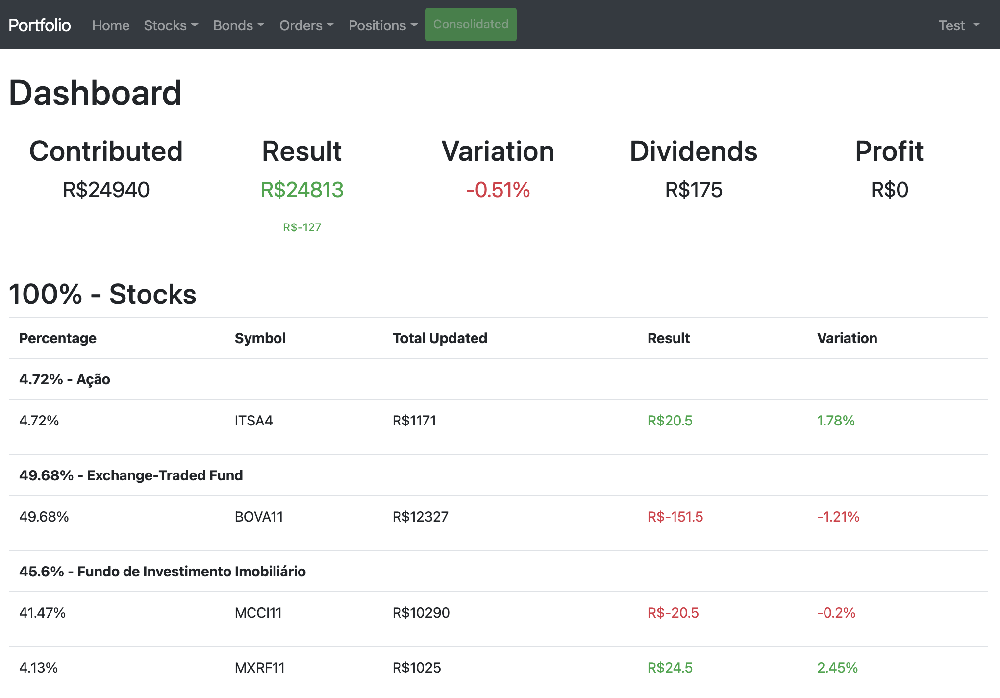
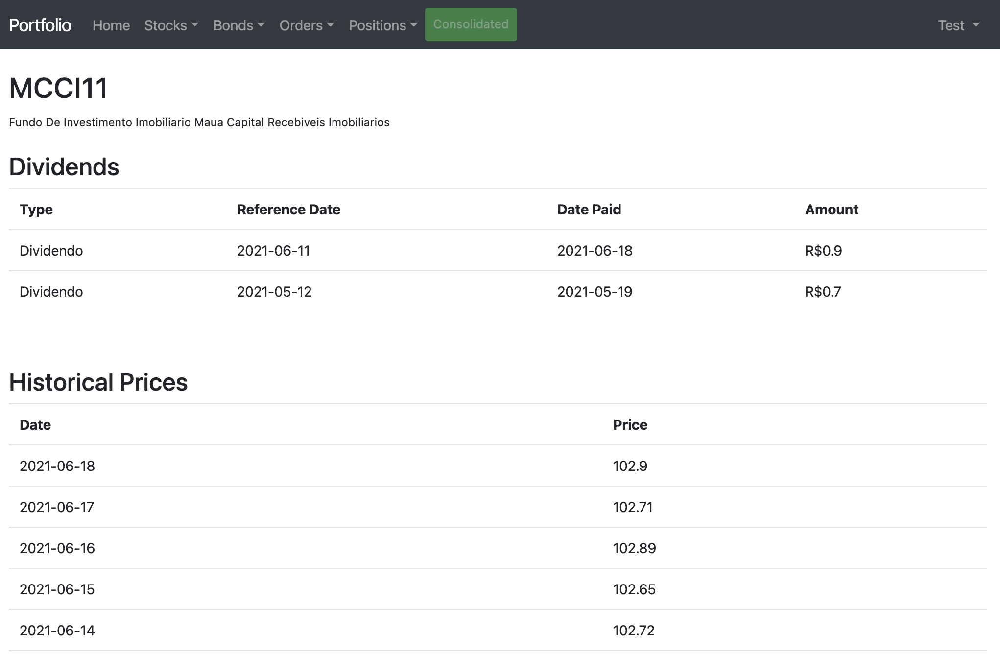
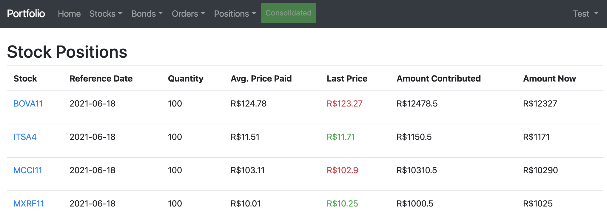

# How to run

Clone the repository and then execute the following commands:

- docker-compose up
- docker-compose run --rm composer install --ignore-platform-reqs
- docker-compose run --rm npm install
- docker-compose run --rm npm run dev
- cp .env.example .test
- docker-compose run --rm artisan key:generate
- docker-compose run --rm artisan migrate
- docker-compose run --rm artisan db:seed

#### PHPUnit configuration for PhpStorm

- PHPUnit library -> Path to script: /opt/project/vendor/autoload.php
- Docker container -> Network Mode: portfolio_portfolio

# Portfolio

#### Dashboard

#### FII Detailed Information

#### Detailed Positions

